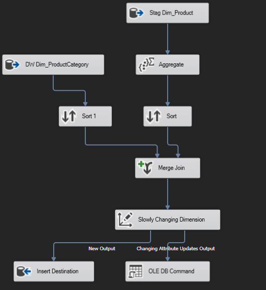

# Data-Warehouse-ETL-BI

•	Database nguồn : AdventureWork2012
 https://learn.microsoft.com/en-us/sql/samples/adventureworks-install-configure?view=sql-server-ver16&tabs=ssms
## Yêu cầu chi tiết Project
### I.	Thiết kế Data warehouse và  ETL cho các báo cáo sau:
1.	Báo cáo doanh số theo từng nhân viên
2.	Báo cáo doanh số theo từng khu vực
3.	Báo cáo số đơn hàng theo nhân viên
4.	Báo cáo số đơn theo khu vực
5.	Báo cáo số lượng bán ra theo nhóm sản phẩm 
6.	Báo cáo số lượng bán ra theo sản phẩm và khu vực
### II.	Tạo Dashboard bằng Power BI
## Thực hiện
### I.	Thiết kế Data warehouse và  ETL
#### 1. Thiết kế Data warehouse
**Lựa chọn lược đồ**

Snowflake schema

**Xây dựng các bảng Dimension**

- Báo cáo doanh số theo từng nhân viên => **Nhân viên** 
- Báo cáo doanh số theo từng khu vực => **Khu vực**
- Báo cáo số đơn hàng theo nhân viên => **Nhân viên**
- Báo cáo số đơn theo khu vực => **Khu vực**
- Báo cáo số lượng bán ra theo nhóm sản phẩm  => **Nhóm sản phẩm**
- Báo cáo số lượng bán ra theo sản phẩm và khu vực => **Sản phẩm, Khu vực**

Các dimension cần tạo : **Nhân viên, Khu vực, Sản phẩm,  Nhóm sản phẩm, Thời gian**

**Xây dựng các bảng Fact**

- Báo cáo doanh số theo từng nhân viên => **Doanh số**
- Báo cáo doanh số theo từng khu vực => **Doanh số**
- Báo cáo số đơn hàng theo nhân viên =>  **Số đơn hàng**
- Báo cáo số đơn theo khu vực => **Số đơn hàng**
- Báo cáo số lượng bán ra theo nhóm sản phẩm  => **Số lượng sản phẩm**
- Báo cáo số lượng bán ra theo sản phẩm và khu vực => **Số lượng sản phẩm**

Báo cáo 1, 2, 3, 4 gộp thành **Fact_SalesOrder**

Báo cáo 5, 6  gộp thành **Fact_Product**

#### 2. ETL
**Data Flow Task**

Khi load dữ liệu, ta sẽ load từ ngoài vào trong (Load các bảng Dimension trước rồi sau đó đến bảng Fact).

**Chi tiết**

Load các bảng Dimension từ Data source vào vùng Staging

Transform dữ liệu vào các bảng Fact của vùng Staging

Load các bảng Dimension từ Staging vào Data warehouse (Vì lượng dữ liệu lớn nên chia ra 2 nhánh để có thể thực hiện song song giúp nhanh hơn)

Load các bảng Fact từ Staging vào Data warehouse

Truncate các dữ liệu không cần thiết ở vùng Stag

### II.	Tạo Dashboard bằng Power BI

